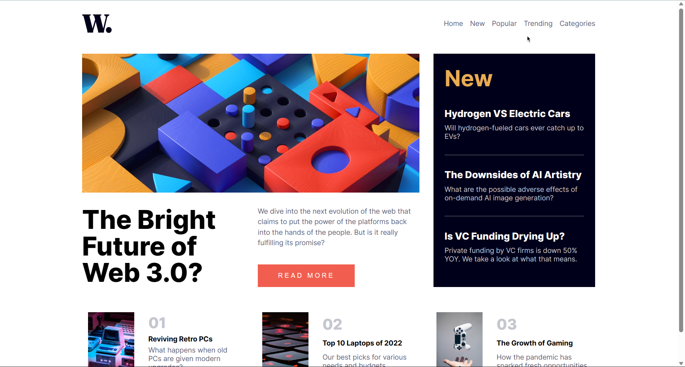

# Frontend Mentor - News homepage solution

This is a solution to the [News homepage challenge on Frontend Mentor](https://www.frontendmentor.io/challenges/news-homepage-H6SWTa1MFl). Frontend Mentor challenges help you improve your coding skills by building realistic projects.

## Table of contents

- [Overview](#overview)
  - [The challenge](#the-challenge)
  - [Screenshot](#screenshot)
  - [Links](#links)
- [My process](#my-process)
  - [Built with](#built-with)
  - [What I learned](#what-i-learned)
  - [Continued development](#continued-development)
  - [Useful resources](#useful-resources)
- [Author](#author)
- [Acknowledgments](#acknowledgments)

**Note: Delete this note and update the table of contents based on what sections you keep.**

## Overview

### The challenge

Users should be able to:

- View the optimal layout for the interface depending on their device's screen size
- See hover and focus states for all interactive elements on the page

### Screenshot



### Links

- Solution URL: [Github Code](https://github.com/byNico1/news-homepage)
- Live Site URL: [Website](https://bynico1.github.io/news-homepage/)

## My process

### Built with

- Semantic HTML5 markup
- CSS custom properties
- Flexbox

### What I learned

I learned a lot about css positioning I really have many things to improve about that, and I think my code could still improve a lot but still I am learning and learned a lot as putting my knowladge into practice, I learned some things about javascript that I already knew but as I didnt put it into practice I kind of forgot some things.

```css
.nav-item + .nav-item {
  margin-left: 1em;
}
.left-section {
  display: flex;
  justify-content: flex-start;
  align-items: center;
  gap: 30px;
  flex-direction: column;
}

.cols-2-container {
  max-width: 1110px;
  gap: 30px;
  width: 90%;
  margin: 0 auto;
}
```

### Continued development

I want to improve on using better class names like using BEM it's just sometimes I don't know if it's completely useful and sometimes i get confuse about it but I do really want to implement it

## Author

- Website - [My Website (still making improvements on it)](https://nikofoque.netlify.app/)
- Frontend Mentor - [@byNico1](https://www.frontendmentor.io/profile/byNico1)
